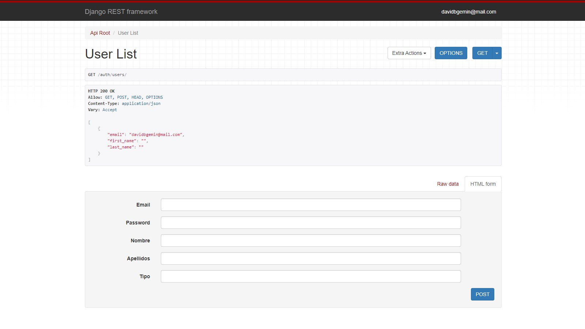
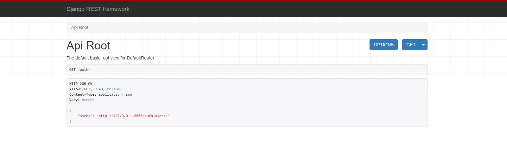
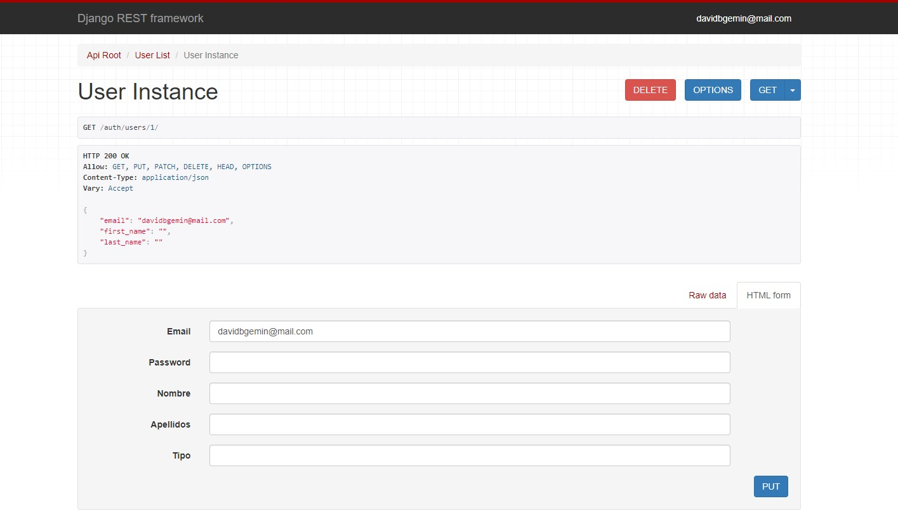

# Proyecto Escuela

Esta es una proyecto web que contiene cursos pregrabados online. Los profesores pueden postular para enseñar los cursos que desean y los alumnos cuentan con un feed donde pueden elegir los cursos que más les interesan para comprarlos a través de una pasarela de pago.

### La estructura del proyecto es la siguiente:
- ***Backend***: RESTFul API basada en Django
    - Librerías utilizadas:
        - djangorestframework-simplejwt==4.6.0
        - djoser==2.1.0
        - mercadopago==2.0.6
        - django-cors-headers==3.7.0
    
    
    &nbsp;
    
    &nbsp;
    
    &nbsp;
- ***Frontend***: contiene las vistas del proyecto en react